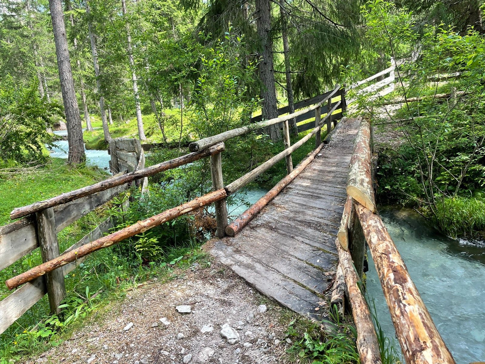

*Dolomites, Italy  — My first marathon, July 2024.* 

# Strong convictions, loosely held

In 1877, in his essay "The Fixation of Belief", Charles Sanders Peirce argued that inquiry begins with doubt and progresses through experimentation and reasoning — meaning beliefs should be held tentatively, always open to revision when confronted with new evidence. This set the intellectual foundation for “strong convictions, loosely held.” 

This blog seeks to publish information that the author finds useful, but when the facts change, hopefully we can change our minds. To that end, please reach out if you have a different point of view, and I will be grateful for the insight.  I'm not a doctor and this is not medical advice, hopefully it's helpful, feel free to delete.    

## RESOURCES

#### Wim Hof breathing 

[https://www.youtube.com/watch?v=Cuxppurd-tw](https://www.youtube.com/watch?v=Cuxppurd-tw)

Cyclic breathing resets the nervous system

#### Family secret smoothie recipe

[link]  

#### Training for the Uphill Athlete: A Manual for Mountain Runners and Ski Mountaineers

[https://uphillathlete.com/](https://uphillathlete.com/)

Author Scott Johnston coached the top male and female of this year's UTMB and the book was co-authored by Kilian Jornet 

...also his bonus core workout (thoughts and prayers): [https://www.youtube.com/watch?v=IKqpbU1Y3bU](https://www.youtube.com/watch?v=IKqpbU1Y3bU) 

#### Some Work All Play podcast 

[https://podcasts.apple.com/us/podcast/some-work-all-play/id1521532868](https://podcasts.apple.com/us/podcast/some-work-all-play/id1521532868)

Megan and David Roche - science and love of running

#### Gordo Byrn Youtube channel

[https://www.youtube.com/@feelthebyrn](https://www.youtube.com/@feelthebyrn)

Technical training tips 

...you are loved 

